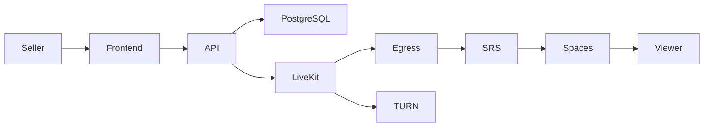

# Architecture

## Project Overview

Live Shopping Platform is a full-stack application that enables sellers to broadcast live video streams while allowing viewers to watch them with low latency.

The project combines WebRTC for real-time publishing with HLS for scalable playback and supports stream recording.

The project consists of two repositories:

- **Frontend:** https://github.com/harry177/live-shopping-frontend
- **Backend:** https://github.com/harry177/live-shopping-backend

---

## Technology Stack

### Frontend

- Next.js
- React
- TypeScript
- Tailwind CSS

### Backend

- Node.js
- Express
- TypeScript
- PostgreSQL (Supabase)
- Redis

### Media Infrastructure

- LiveKit
- LiveKit Egress
- SRS
- coturn

### Infrastructure

- Docker Compose
- Nginx
- DigitalOcean Spaces (HLS storage)
- TLS certificates

---

## High-Level Architecture

---

## Main Components

### Frontend

The frontend provides the user interface for:

- authentication
- stream creation
- broadcaster controls
- viewer interface
- stream discovery

It communicates only with the backend API and LiveKit.

---

### Backend API

The backend is responsible for:

- authentication
- stream lifecycle
- generating LiveKit access tokens
- stream metadata
- user management
- authorization
- database access

The backend coordinates the media pipeline but does not process video itself.

---

### LiveKit

LiveKit acts as the WebRTC SFU responsible for receiving media streams from broadcasters and distributing them to connected participants.

Using an SFU minimizes latency while allowing multiple viewers to subscribe to the same stream.

---

### LiveKit Egress

LiveKit Egress subscribes to the live room and exports the media stream in RTMP format.

This decouples real-time communication from video processing and recording.

---

### SRS

SRS receives the RTMP stream produced by LiveKit Egress.

Its responsibilities include:

- HLS generation
- live playlist management
- recording support

---

### DigitalOcean Spaces

Generated HLS playlists and media segments are synchronized to object storage.

Using object storage allows HLS content to be delivered through a CDN instead of directly from the application server.

---

### Redis

Redis is used as a lightweight in-memory service supporting media-related infrastructure.

---

### coturn

coturn provides TURN/STUN services required for users behind NATs and restrictive firewalls, ensuring reliable WebRTC connectivity.

---

## Streaming Flow

A typical live stream follows this sequence:

1. Seller creates a new stream.
2. Backend validates the request.
3. Backend generates a LiveKit access token.
4. Seller joins the LiveKit room.
5. Camera and microphone are published.
6. LiveKit Egress subscribes to the room.
7. Egress produces an RTMP stream.
8. SRS converts RTMP into HLS.
9. HLS playlists and segments are synchronized to DigitalOcean Spaces.
10. Viewers watch the stream using HLS playback.

---

## Deployment

The application was originally deployed on a single Ubuntu VPS using Docker Compose.

The deployment included:

- Node.js API
- LiveKit
- LiveKit Egress
- SRS
- Redis
- coturn
- Nginx reverse proxy
- TLS certificates for secure HTTPS and WebSocket communication

External services:

- Supabase PostgreSQL
- DigitalOcean Spaces

---

## Future Improvements

Potential future improvements include:

- adaptive bitrate streaming
- chat moderation
- stream analytics
- automatic clipping
- AI-powered stream summaries
- horizontal API scaling
- Kubernetes deployment